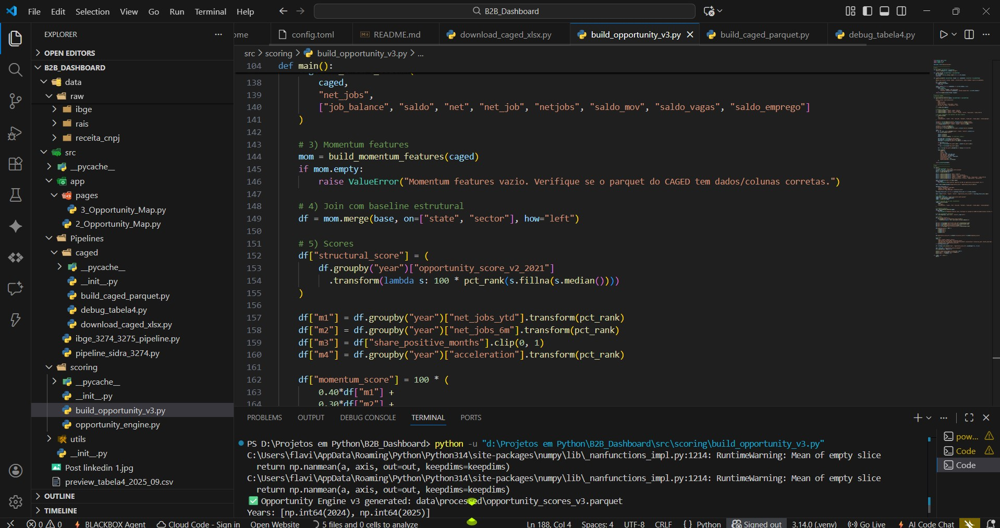
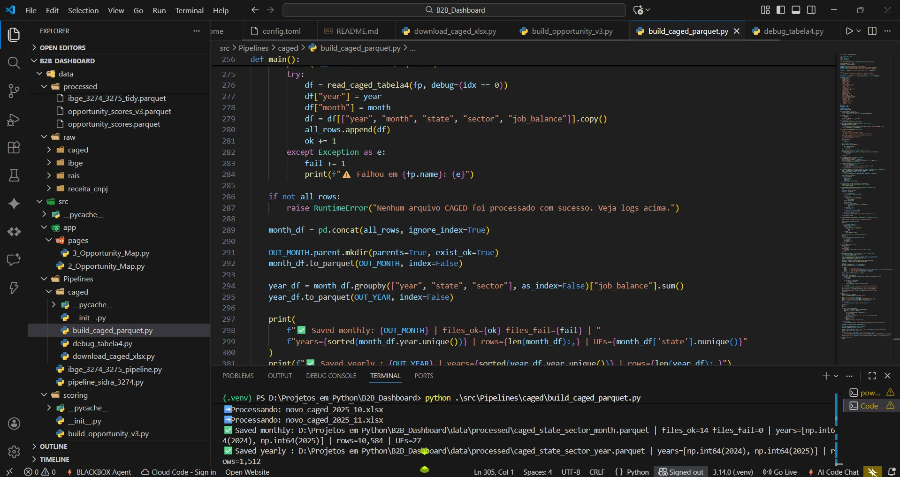

# B2B_Dashboard
Plataforma de inteligência econômica que integra dados do IBGE e CAGED para mapear crescimento, oportunidades B2B e dinâmica setorial no Brasil.

Economic Intelligence Platform that integrates IBGE and CAGED data to map growth, B2B opportunities, and sectoral dynamics in Brazil.

## 🖥️ Visão do Projeto

### Pipeline de dados e Opportunity Engine


### Dashboard interativo (Streamlit)



# 📊 Mapeamento do Crescimento Empresarial e Oportunidades B2B no Brasil  
# 📊 Mapping Business Growth and B2B Opportunities in Brazil

---

## 🇧🇷 Sobre o Projeto | 🇺🇸 About the Project

### 🇧🇷 Português
Este projeto tem como objetivo **analisar o cenário empresarial brasileiro** a partir de dados públicos,
identificando **regiões, estados e setores econômicos em crescimento**, com foco em **oportunidades B2B**.

A proposta é transformar dados brutos em **inteligência de mercado**, apoiando:
- tomada de decisão estratégica  
- prospecção B2B  
- análise de novos mercados  
- identificação de polos empresariais emergentes  

O dashboard foi desenvolvido com **storytelling orientado a negócios**, permitindo uma leitura clara,
visual e acionável do ambiente empresarial brasileiro.

### 🇺🇸 English
This project aims to **analyze the Brazilian business landscape** using public data sources,
identifying **growing regions, states, and economic sectors**, with a strong focus on **B2B opportunities**.

The goal is to transform raw data into **market intelligence**, supporting:
- strategic decision-making  
- B2B market prospection  
- new market analysis  
- identification of emerging business hubs  

The dashboard was built with **business-oriented storytelling**, enabling clear,
visual, and actionable insights into the Brazilian business environment.

---

## 🎯 Objetivos | Objectives

### 🇧🇷 Português
- Mapear a abertura de empresas por região e estado  
- Identificar estados em crescimento dentro de cada região  
- Analisar setores econômicos com maior potencial B2B  
- Criar uma base de consulta estratégica para empreendedores e investidores  

### 🇺🇸 English
- Map business openings by region and state  
- Identify high-growth states within each region  
- Analyze economic sectors with strong B2B potential  
- Build a strategic reference base for entrepreneurs and investors  

---

## 🧠 Abordagem Analítica | Analytical Approach

### 🇧🇷 Português
- Análise exploratória de dados (EDA)  
- Agregações por região, estado e setor  
- Visualizações interativas com foco executivo  
- Storytelling orientado a oportunidades de negócio  

### 🇺🇸 English
- Exploratory Data Analysis (EDA)  
- Aggregations by region, state, and economic sector  
- Interactive visualizations with an executive focus  
- Business-oriented storytelling focused on market opportunities  

---

## 📊 Principais Análises | Key Analyses

### 🇧🇷 Português
- Evolução da abertura de empresas ao longo do tempo  
- Comparação entre regiões brasileiras  
- Identificação de estados emergentes dentro de cada região  
- Distribuição setorial com foco em mercados B2B  

### 🇺🇸 English
- Business openings evolution over time  
- Comparison across Brazilian regions  
- Identification of emerging states within each region  
- Sector distribution with a B2B market focus  

---

## 🛠️ Tecnologias Utilizadas | Technologies

### 🇧🇷 Português
- Python  
- Pandas  
- NumPy  
- Parquet (data lake analítico)  
- Pipelines automatizados (ETL)  
- Scikit-learn (modelos estatísticos)  
- Streamlit (visualização executiva)  
- Plotly / GeoJSON (mapas e análises espaciais)  

### 🇺🇸 English
- Python  
- Pandas  
- NumPy  
- Parquet (analytics data lake)  
- Automated pipelines (ETL)  
- Scikit-learn (statistical models)  
- Streamlit (executive dashboards)  
- Plotly / GeoJSON (maps and spatial analytics)  

---

## 📁 Estrutura do Projeto | Project Structure

```text
B2B_Dashboard/
│
├── dashboards/
│   └── app.py                  # Streamlit app (working)
│
├── data/
│   ├── geo/
│   │   └── brazil_states.geojson
│   │
│   ├── processed/
│   │   ├── companies_agg.parquet
│   │   ├── ibge_3274_3275_tidy.parquet
│   │   ├── opportunity_scores.parquet
│   │   ├── opportunity_scores_v3.parquet
│   │   ├── caged_state_sector_month.parquet
│   │   └── caged_state_sector_year.parquet
│   │
│   └── raw/
│       └── caged/
│           └── caged_xlsx/
│               ├── novo_caged_2024_01.xlsx
│               ├── novo_caged_2024_02.xlsx
│               └── ...
│
└── src/
    ├── Pipelines/
    │   ├── caged/
    │   │   ├── download_caged_xlsx.py
    │   │   └── build_caged_parquet.py
    │   └── ibge_3274_3275_pipeline.py
    │
    └── scoring/
        ├── opportunity_engine.py
        └── build_opportunity_v3.py

🚧 Status do Projeto | Project Status
🇧🇷 Português
🔧 Em desenvolvimento
O projeto está em evolução contínua, com foco em aprofundar a análise regional,
melhorar a qualidade dos dados e ampliar os insights estratégicos para o mercado B2B.

🇺🇸 English
🔧 Under development
This project is under continuous development, focusing on deeper regional analysis,
improved data quality, and expanded strategic insights for the B2B market.

🗺️ Próximos Passos | Next Steps
🇧🇷 Português
Consolidar o Opportunity Score v3 (IBGE + CNPJ + CAGED)
Criar módulo Market Momentum e Hiring Heatmap no Streamlit
Desenvolver modelos preditivos para tendências de 2026
Adicionar camada LLM + RAG para narrativas executivas (“onde investir, por quê e quando”)

🇺🇸 English
Consolidate Opportunity Score v3 (IBGE + CNPJ + CAGED)
Add Market Momentum and Hiring Heatmap modules in Streamlit

Build predictive models for 2026 trends

Add LLM + RAG layer for executive narratives (“where to invest, why, and when”)

📌 Considerações Finais | Final Notes
🇧🇷 Português
Este projeto faz parte de um portfólio em Ciência de Dados e Business Intelligence,
com foco em transformar dados públicos em insights estratégicos para tomada de decisão,
especialmente no contexto B2B.

🇺🇸 English

This project is part of a Data Science and Business Intelligence portfolio,
focused on turning public data into strategic decision-making insights,
especially in a B2B context.


## 👤 Author

Flávia Dottori  
Data Science & Market Intelligence  

LinkedIn: https://www.linkedin.com/in/fmdottori  


